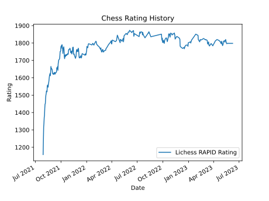
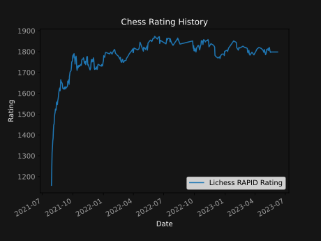
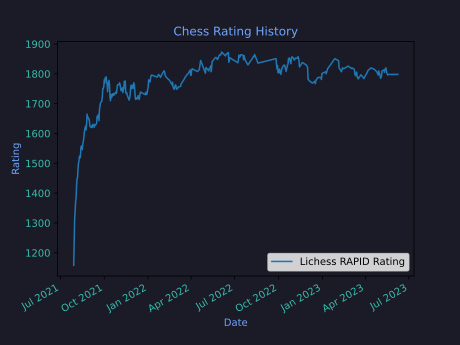

# Chess Rating Graph

A graph showing Lichess rating over time using the Berserk API hosted on Heroku.

More features will be added in the future such as integrations with chess.com and FIDE

## User Guide

- Fork this repository and deploy it to Heroku
- Lichess puzzles are not included in the graph, comment out below in index.py if needed
```
if (LichessRatingType(i).value == LichessRatingType.PUZZLES.value):
    continue
```
- Make sure to set the CONFIG VARS in Heroku:
    - LICHESS_API_TOKEN: Paste your API token from https://lichess.org/account/oauth/token
    - LICHESS_USERNAME: Your Lichess username
- Different mode available based on filename:
    - Default: https://chess-rating-graph.herokuapp.com/
    
    - Dark Mode: https://chess-rating-graph.herokuapp.com/dark
    
    - Tokyo Night Mode: https://chess-rating-graph.herokuapp.com/tokyo
    

Colour palette based on https://github.com/anuraghazra/github-readme-stats/blob/master/themes/